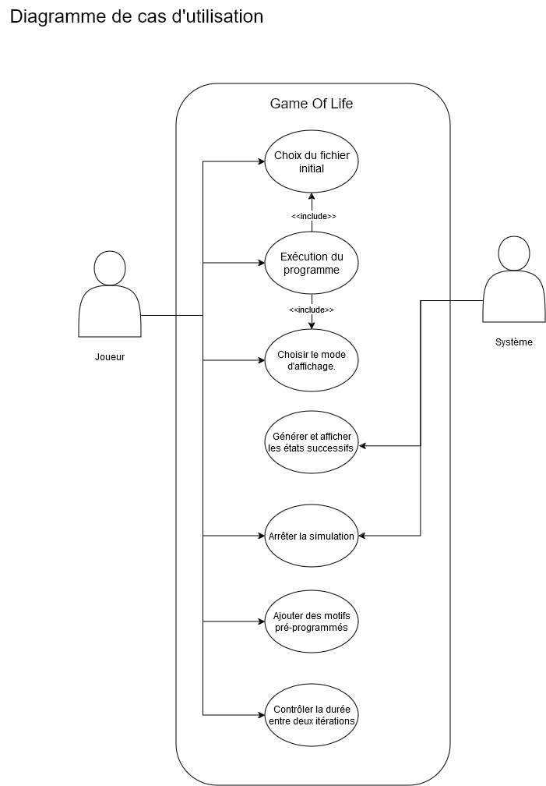
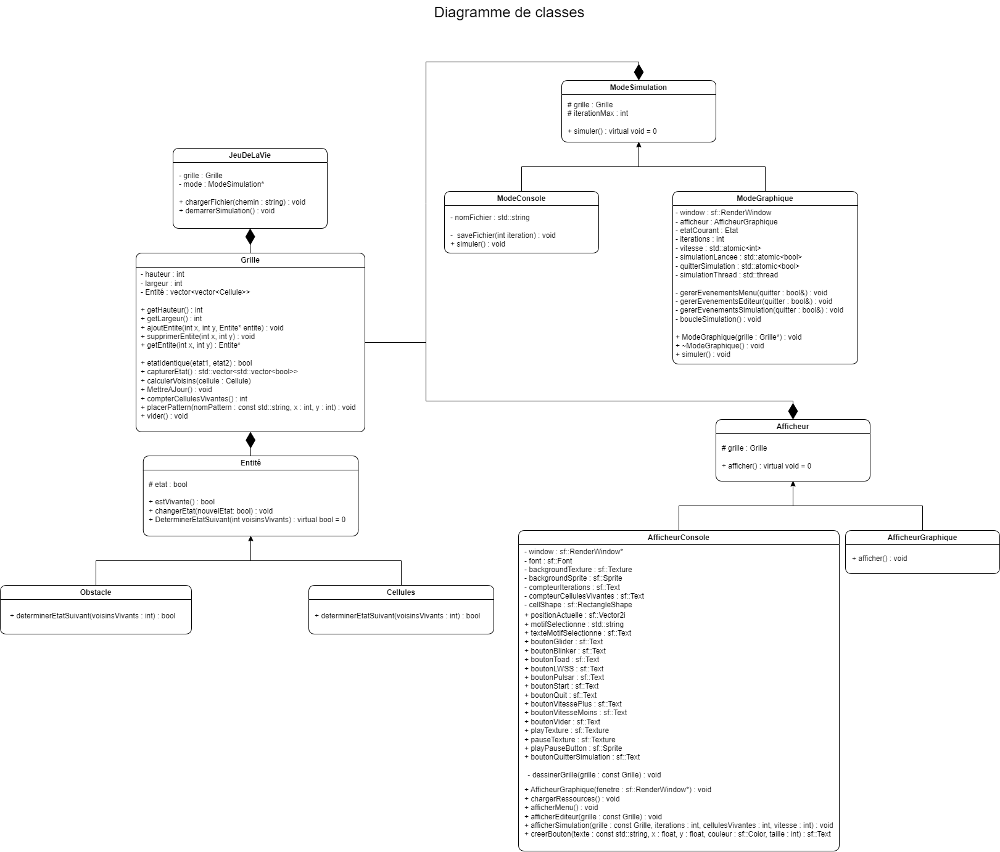
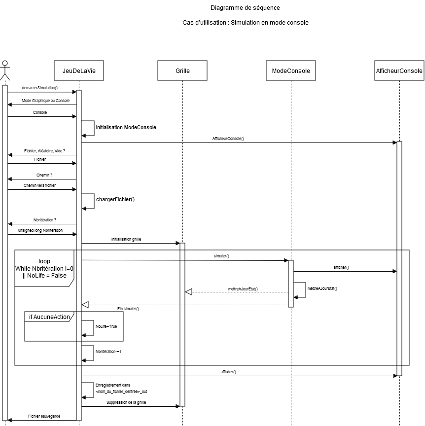
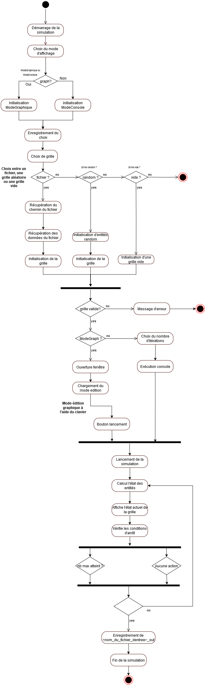

# Conway's Game of Life 🎮

Bienvenue dans le projet Conway's Game of Life! Ce projet implémente le célèbre automate cellulaire inventé par John Conway avec quelques variantes. Vous pouvez choisir entre deux modes de jeu : le mode console et le mode graphique.
Ce projet est développé en C++ en utilisant les principes de la programmation orientée objet (POO). Il utilise l'héritage et le polymorphisme pour structurer le code de manière modulaire et réutilisable. Les différentes entités du jeu, comme les cellules et les grilles, sont représentées par des classes avec des relations d'héritage. Le polymorphisme est utilisé pour gérer les différentes règles de transition des cellules, facilitant ainsi l'ajout de nouvelles variantes du jeu de la vie.

## Table des matières 📚

- [Installation](#installation)
- [Utilisation](#utilisation)
- [Fonctionnalités](#fonctionnalités)
- [Contribuer](#contribuer)
- [Diagrammes](#diagrammes)
- [Licence](#licence)

## Installation 🛠️

Pour installer ce projet, suivez les étapes ci-dessous :

1. Clonez le dépôt :
    ```sh
    git clone https://github.com/votre-utilisateur/ConwayGoL.git
    ```
2. Accédez au répertoire du projet :
    ```sh
    cd ConwayGoL
    ```
3. Compilez le projet :
    ```sh
    make
    ```

## Utilisation 🚀

Pour exécuter le projet, utilisez la commande suivante :
```sh
./main
```

Vous serez invité à choisir le mode de jeu et la grille de départ.

## Fonctionnalités ✨

- **Mode Console** : Affiche la simulation dans la console.
- **Mode Graphique** : Affiche la simulation avec une interface graphique utilisant SFML.
- **Chargement de Grille** : Chargez des grilles pré-remplies à partir de fichiers.
- **Éditeur de Grille** : Créez et modifiez des grilles en mode graphique.
- **Sauvegarde de Simulation** : Sauvegardez l'état de la grille à chaque itération.

## Arborescence 🌳
```
.
├── assets
│   ├── Archive.ttf
│   ├── background.png
│   ├── pause.png
│   └── play.png
├── Diagrams
│   ├── Diagramme d'activités.png
│   ├── Diagramme de cas d'utilisation.png
│   ├── Diagramme de classes.png
│   └── Diagramme de séquence.png
├── Grilles
│   ├── 70x90
│   ├── pulsar
│   └── pulsar_out
├── include
│   ├── afficheurConsole.hpp
│   ├── afficheurGraphique.hpp
│   ├── afficheur.hpp
│   ├── cellules.hpp
│   ├── entite.hpp
│   ├── grille.hpp
│   ├── modeConsole.hpp
│   ├── modeGraphique.hpp
│   ├── modeSimulation.hpp
│   └── obstacle.hpp
├── LICENSE
├── main
├── main.cpp
├── Makefile
├── README.md
└── src
    ├── afficheurConsole.cpp
    ├── afficheurGraphique.cpp
    ├── cellules.cpp
    ├── grille.cpp
    ├── modeConsole.cpp
    ├── modeGraphique.cpp
    └── modeSimulation.cpp
```

## Contribuer 🤝

Les contributions sont les bienvenues ! Pour contribuer :

1. Forkez le projet.
2. Créez votre branche de fonctionnalité (`git checkout -b feature/AmazingFeature`).
3. Commitez vos modifications (`git commit -m 'Add some AmazingFeature'`).
4. Poussez votre branche (`git push origin feature/AmazingFeature`).
5. Ouvrez une Pull Request.

## Diagrammes 📊

Voici les différents diagrammes utilisés dans ce projet :

### Diagramme d'Utilisation

### Diagramme de Classes

### Diagramme de Séquence

### Diagramme d'Activité


## Licence 📄

Ce projet est sous licence GPLv3. Voir le fichier [LICENSE](./LICENSE) pour plus de détails.
